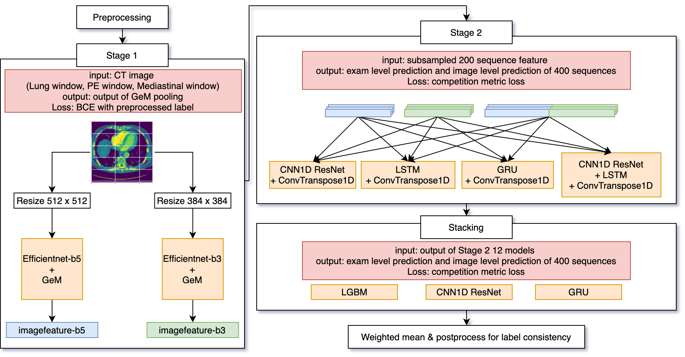

# kaggle-rsna-2020-9th-solution
the 9th place solution code of Kaggle RSNA STR Pulmonary Embolism Detection (https://www.kaggle.com/c/rsna-str-pulmonary-embolism-detection/overview)


## Solution OverView


## Solution Details

Please read [this post](https://www.kaggle.com/c/rsna-str-pulmonary-embolism-detection/discussion/193417) on Kaggle Discussion.

## Hardware

Our team mainly use cloud machine with following spec on GCP Platform.
```
OS: Ubuntu 18.04 LTS
GPU: Tesla V100 x4
```
## Requirement

You should install docker-ce.
If you don't have docker installed, please refer to [this page](https://docs.docker.com/engine/install/debian/) to install it.

## How to use


### Data download

Plese download data to `./input` from https://www.kaggle.com/c/rsna-str-pulmonary-embolism-detection/data and unzip it.

### build docker

```
$ docker build ./images -t kaggle/pytorch:rsna
```


### Prerocess

```shell script
$ sh ./bin/preprocess.sh
```
### Stage1


```shell script
# Train and extract feature
$ sh ./bin/stage_1_train.sh
$ sh ./bin/stage_1_predict_valid.sh
# Extract feature from test data
$ sh ./bin/stage_1_predict_test.sh
```

### Stage2


```shell script
# Train
$ sh ./bin/stage_2_384_train.sh
$ sh ./bin/stage_2_512_train.sh
$ sh ./bin/stage_2_concat_train.sh
# Predict test data
$ sh ./bin/stage_2_384_test.sh
$ sh ./bin/stage_2_512_test.sh
$ sh ./bin/stage_2_concat_test.sh
```

### Stacking


```shell script
# Train
$ sh ./bin/stacking_train.sh
# Predict test data
$ sh ./bin/stacking_test.sh
```

### Blending


```shell script
$ sh ./bin/blending.sh
```

The final output is generated in `./output/final_submission.csv`.